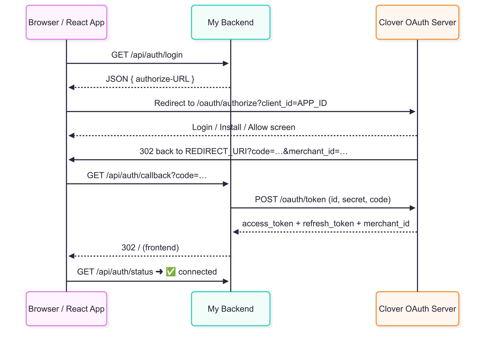

# Clover Payment Demo (Node + React)

A minimal checkout app that authenticates with **Clover OAuth2**, creates an order, and pays it using the sandbox API.  
Great as a reference or starter template for integrating Clover payments into your own project.

---

## ✨ Features

* **OAuth2 “Connect Clover Account”** button (private-app install + consent)
* Automatic **token refresh** using the saved `refresh_token`
* Simple **order + line-item + test payment** flow
* One-click **sandbox** setup; swap the base URL to hit production later

---

## 🛠 Prerequisites

| Tool | Version |
|------|---------|
| Node | 20 or newer |
| npm  | 8 or newer |
| Clover **sandbox** merchant account & a **private OAuth app** |

---

## 🔑 Environment Variables

Create **`.env`** at the project root:

## Clover sandbox credentials
* CLOVER_CLIENT_ID=YOUR_APP_ID
* CLOVER_CLIENT_SECRET=YOUR_APP_SECRET
* CLOVER_REDIRECT_URI=http://localhost:5000/api/auth/callback

# Optional – port overrides
* PORT=5000
* REACT_PORT=3000

1‒ Install deps
* npm install --prefix backend
* npm install --prefix frontend

2‒ Start API (terminal 1)
npm run dev --prefix backend   # nodemon, hot-reload

3‒ Start UI (terminal 2)
npm start --prefix frontend

## OAuth2 Flow (Sequence Diagram)

## ℹ️ Additional Notes:

* Security – client_secret is sent only server-to-server; never expose it in the browser.

* Single install – After the merchant installs once, Clover skips the install screen on future logins and returns a fresh code immediately.

* Token refresh – The backend silently refreshes when less than 60 s of validity remain.

* Scopes – For this demo you need payments.read + payments.write. Add more only if required.

